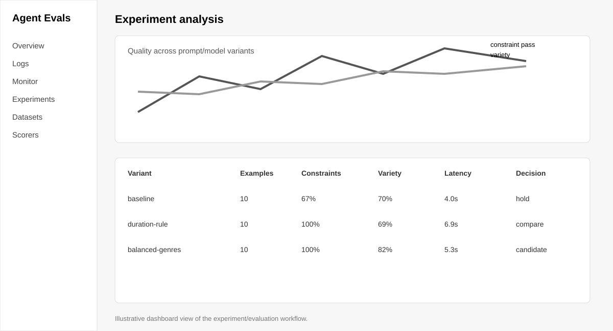

# Subjective Agent Evals

A runnable evaluation framework for a deceptively hard AI-product question: **how do you measure whether an agent is getting better when quality is partly subjective?**

The example domain is playlist generation because it makes the problem easy to understand: a playlist can satisfy hard constraints and still feel repetitive, incoherent, or poorly matched to the user's intent.

## Experiment preview



The project uses Braintrust experiments to compare variants across deterministic constraints and subjective quality dimensions. The visual above illustrates the workflow and the kind of experiment comparison the project is designed to produce.

## What is runnable

The repository has two layers:

1. **Offline deterministic evaluation** — Python scorers and pytest tests run without any external service.
2. **Braintrust experiment** — `braintrust_eval.py` uses Braintrust's Python `Eval()` workflow to log and compare an experiment when `BRAINTRUST_API_KEY` is configured.

```bash
python -m venv .venv
source .venv/bin/activate
pip install -r requirements.txt
pytest -q
```

To send the sample experiment to Braintrust:

```bash
export BRAINTRUST_API_KEY="..."
python braintrust_eval.py
```

The sample task is deterministic on purpose, so the evaluation plumbing can be inspected before introducing another model/API variable.

## Why this project

Many AI demos stop after the agent produces a plausible answer. Production teams need a repeatable way to answer whether a new prompt actually improved quality, which journeys regressed, whether a more expensive model is worth it, and which requirements should be deterministic versus model- or human-judged.

## Evaluation dimensions

| Dimension | Type | Example |
|---|---|---|
| Duration | Deterministic | Playlist must be <= 30 minutes |
| Track count | Deterministic | Requested number of tracks |
| Explicit constraints | Deterministic | Required / excluded genres or artists |
| Variety | Heuristic / model judge | Avoid repetitive artists and near-duplicate tracks |
| Mood fit | Model / human judge | Does the result match “calm morning run”? |
| Coherence | Model / human judge | Does the playlist feel intentional as a sequence? |
| Safety | Policy / deterministic | Excluded content is not returned |

## Evaluation flywheel

```text
Production traces / curated examples
              |
              v
         Evaluation dataset
              |
              v
      Prompt / model variants
              |
              v
      Deterministic + judged scores
              |
              v
     Compare failures and trade-offs
              |
              v
       Ship + monitor online
              |
              +------> new hard cases
```

## Four-week pilot pattern

**Week 1 — Instrument:** capture representative traces and identify important journeys.  
**Week 2 — Curate:** create a high-quality dataset from production-like examples and known failures.  
**Week 3 — Define quality:** agree on hard constraints, subjective dimensions, latency, and cost.  
**Week 4 — Compare and operationalize:** run experiments, inspect failures, select a candidate, and define online monitoring.

## Current implementation

- [x] Example evaluation dataset
- [x] Deterministic scoring utilities
- [x] Unit tests and GitHub CI
- [x] Braintrust `Eval()` integration
- [x] Human/model-judge rubric design
- [x] Visual experiment preview
- [ ] LLM-as-judge adapter
- [ ] Trace ingestion example
- [ ] Online monitoring example

## What this demonstrates

This project is less about playlist generation than about **evaluation design and deployment judgment**: turning fuzzy product expectations into measurable criteria, building a dataset around important journeys, comparing changes consistently, and using failures to drive the next iteration.

— Anastasia Chueva
